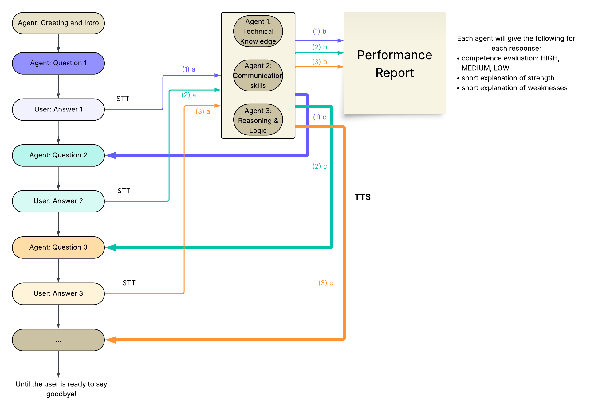

# Interview Practice Agent with Cartesia and Cerebras
Let's design a real-time interviewer voice agent integrating Cerebras and Cartesia. The general workflow looks like this:



We will guide you step by step on how to implement this workflow using Cartesia and Cerebras API's !

## Getting started
First things first, here is what you will need:
- A [Cerebras API Key](https://cloud.cerebras.ai/platform/org_vf4x9pfwd8wwcktm6jvp2rne/playground)
- A [Cartesia](https://play.cartesia.ai/agents) account and api key

Make sure to add the api keys in your `.env` file or to the API keys section in your Cartesia account.
- Required packages:
  ```bash
  cartesia-line
  cerebras.cloud.sdk
  python-dotenv
  loguru
  ```
Make sure to add the project details along with requirements to `pyproject.toml`.
System prompts, model ID and hyperparameters can be added to the `config.py` file. This file also includes the boolean parameter that determines if the background agents should be activated.

## Talking Agent
`interviewer.py` includes the ReasoningNode subclass that is customized to match Cerebras API. The required utility functions are included in the `cs_utils.py`. Please note that you will need to ensure the tool call schema matches the Cerebras Inference API format [here](https://inference-docs.cerebras.ai/capabilities/tool-use).
This agent calls a tool named `start_interview` which sets a flag to trigger the background agents. This is to ensure that the background agents don't evaluate responses from the user that are given prior to the mock interview.

## Background (Judge) Agents
The ReasoningNode subclass defined in `judges.py` implements the background agent that will evaluate the performance of the user during the mock interview. You could either save the evaluation report in a text file or log it in the output window. These nodes use structured outputs with Cerebras provided models to evaluate the user's performance in real-time. They will not directly interact with the user.

## Handling the call
In the `main.py` file, we need to select the client as below:
```python
cs_client = AsyncCerebras(api_key=os.environ.get("CEREBRAS_API_KEY"))
```
The async call handling function `handle_new_call` should include all the nodes and bridges between them. This function will be used to initialize the application object using the `VoiceAgentApp` class.

## Deploying the agent
Finally, don't forget to add the `cartesia.toml` file that will install and run your script when deployed on the Agents platform. You can simply clone this repository and add it to your [agents dashboard](https://play.cartesia.ai/agents) along with your API Keys.
